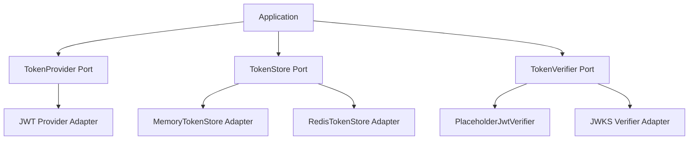

# Getting Started

## Installation

```bash
npm install
npm run build
```

## Usage

```typescript
import { MemoryTokenStore } from './adapters/MemoryTokenStore'
import { PlaceholderJwtVerifier } from './adapters/PlaceholderJwtVerifier'

const store = new MemoryTokenStore()
const verifier = new PlaceholderJwtVerifier()

// Store a token
await store.save({ accessToken: 'my-token', expiresAt: Date.now() + 3600_000 })

// Verify a token
const claims = await verifier.verify('my-token')
```

## Architecture



## Layout

| Path | Role |
|------|------|
| `src/domain/` | Token types, claims, errors |
| `src/ports/` | `TokenProvider`, `TokenStore`, `TokenVerifier` |
| `src/adapters/` | `MemoryTokenStore`, `PlaceholderJwtVerifier` |

## Testing

```bash
npm test
npm run typecheck
```
