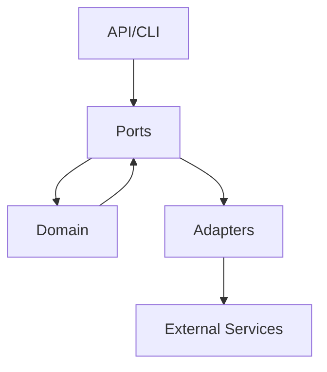

# Guide

Welcome to the phenotype-auth-ts documentation!

## What's New

- [Installation](./installation) - Get started quickly
- [Quick Start](./quickstart) - First authentication flow

## Architecture

phenotype-auth-ts follows hexagonal architecture principles:

## Features

- JWT token issuance and verification
- Multiple OAuth2 grant types
- Pluggable storage adapters
- Express and Fastify middleware
- TypeScript-first design

## Next Steps

1. [Install the package](./installation)
2. [Run your first authentication](./quickstart)
