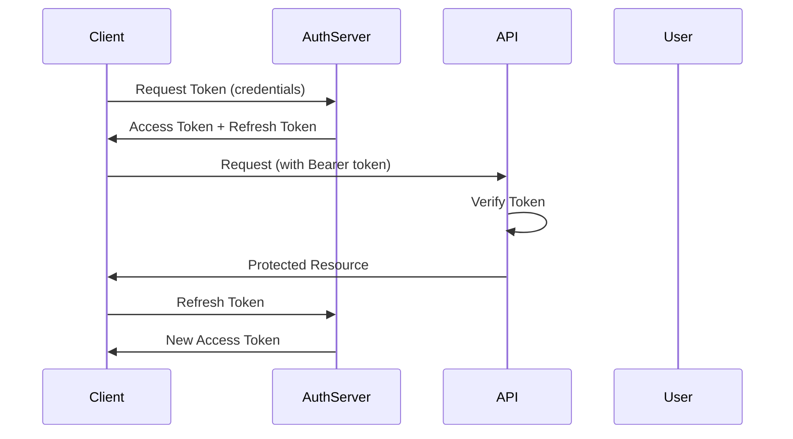

# Core Workflow Journey

This journey covers the standard authentication workflow for production applications.

## Flow Diagram



## Implementation

### 1. Set Up Token Provider

```typescript
import { JwtTokenProvider } from '@phenotype/auth-ts';

const provider = new JwtTokenProvider({
  privateKey: process.env.PRIVATE_KEY,
  issuer: 'https://auth.example.com',
  audience: 'my-api',
  accessTokenTtl: 3600,
  refreshTokenTtl: 604800,
});
```

### 2. Set Up Token Store

```typescript
import { MemoryTokenStore } from '@phenotype/auth-ts';

const store = new MemoryTokenStore();
```

### 3. Issue Client Credentials Token

```typescript
const response = await provider.requestToken({
  grantType: 'client_credentials',
  clientId: 'app-client',
  clientSecret: 'secret',
});
```

### 4. Store Token for Later Use

```typescript
await store.save('user:123', {
  accessToken: response.accessToken,
  tokenType: response.tokenType,
}, response.expiresIn);
```

### 5. Refresh When Expired

```typescript
const newToken = await provider.requestToken({
  grantType: 'refresh_token',
  refreshToken: storedRefreshToken,
});
```

## Best Practices

1. **Secure storage** - Never store tokens in localStorage in production
2. **Token rotation** - Always use refresh tokens
3. **HTTPS only** - Never transmit tokens over plain HTTP
