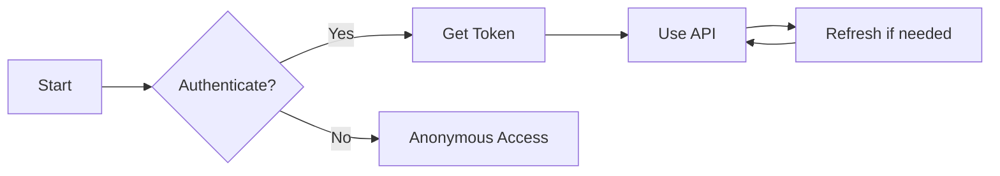

# User Journeys

User journeys describe the end-to-end flows users experience when interacting with the authentication system.

## Available Journeys

| Journey | Description |
|---------|-------------|
| [Quick Start](./quick-start) | Get up and running in 5 minutes |
| [Core Workflow](./core-workflow) | Standard authentication flow |

## Journey Map

## Getting Started

Choose a journey that matches your use case:

1. **Quick Start** - For rapid prototyping
2. **Core Workflow** - For production applications
